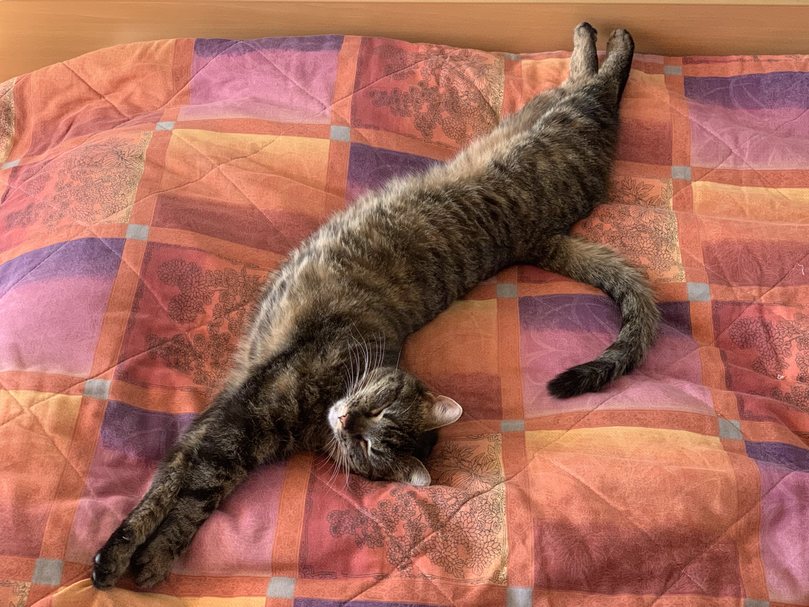

# Hi, welcome to my site!

<!-- Subheader - just add more # signs: ### About me  -->


<!-- This part is introduction -->

My name's Veronika and I'm finishing my master's degree in Money and Finance at Goethe University in Frankfurt am Main. I am from **Slovenia** but I currently live in **Amsterdam**, where I did my QTEM exchange.

From **September** on, I will be a Trainee in the Market Infrastructure & Payments Department at the _ECB_.


<!-- Combining bold and italic: _**I live in Amsterdam.**_  -->
<!-- ### third header  -->

<!-- This is how you create a list:  
RVU has brands:
- uswitch
- test
- money

<!-- This is how you create a numbered list 
1. step1
2. step2
3. step3


<!-- This is how you insert a (hyper)link -->
This is my [LinkedIn](https://www.linkedin.com/in/veronikadraskovicbracun/).

<!--Click [here](https://www.google.com/) for Google. -->

<!-- This is how you insert a picture, the document has to be in the content file-->
This is my cat Elli - she always sleeps in the weirdest positions:



<!-- This is how you make a quote -->
>It is the state of our own minds that matter the most.
>
>John Maynard Keynes

<!-- Code Block: You can use codeblocks (backtick) to show users how you wrote your code! -->
```
Coding experience: Python & R
```


<iframe width="560" height="315" src="https://www.youtube.com/embed/q7DfQMPmJRI" title="YouTube video player" frameborder="0" allow="accelerometer; autoplay; clipboard-write; encrypted-media; gyroscope; picture-in-picture" allowfullscreen></iframe>

