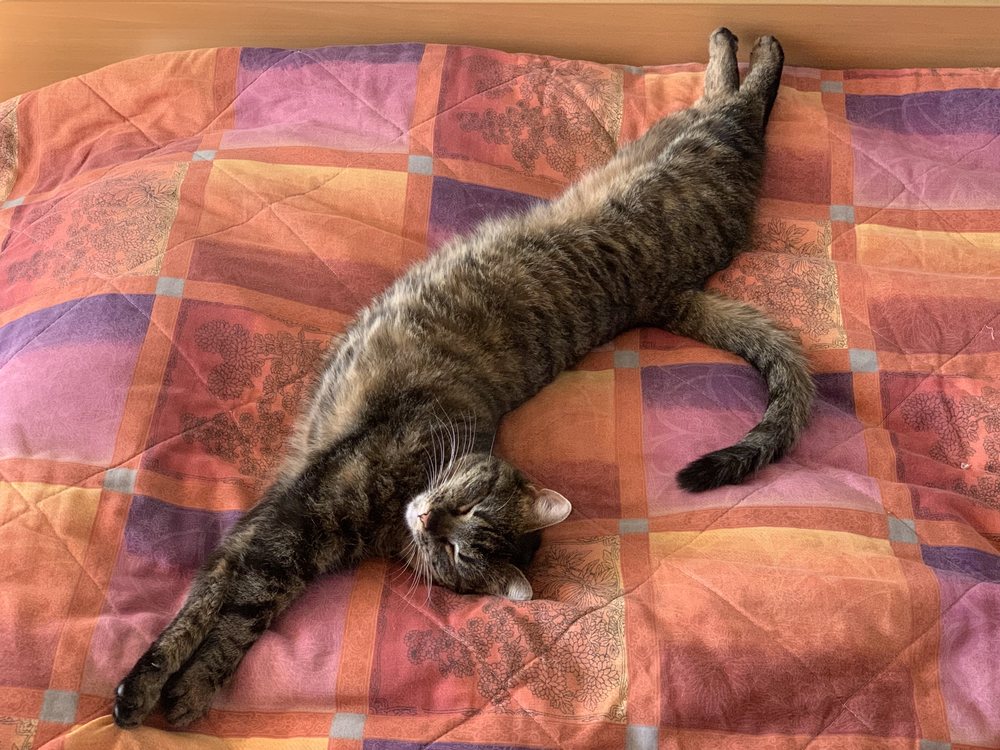

My name's Veronika and I'm close to finishing my master's degree in Money and Finance at Goethe University in Frankfurt am Main. I am from **Slovenia** but I currently live in **Amsterdam**, where I completed my QTEM exchange. From **September** on, I will do a Traineeship in the Market Infrastructure & Payments Department at the _European Central Bank_.


That's me in Lisbon, Portugal!


Academically and professionally, I am most passionate about central banking, so working at the ECB is a dream-come-true for me. Personally, I have several hobbies I greatly enjoy. I love road cycling, snowboarding, and kitesurfing. Lately, I've also been running and I'm still waiting for it to become more enjoyable for me. I've been practicing yoga and meditation for a few years. I equally enjoy reading fiction and non-fiction books. Recently, I stopped drinking coffee and replaced it with tea, which has become my latest obsession. My favorite is any type of Oolong tea. 


<!-- This is how you insert a picture, the document has to be in the content file-->
This is my cat Elli - she always sleeps in the weirdest positions!



Here is a random, but good quote from a famous economist:
<!-- This is how you make a quote -->
>It is the state of our own minds that matter the most.
>
>John Maynard Keynes

This is one of my favorite bands. I recently went to their concert in Amsterdam - it was amazing!

<!-- Code Block: You can use codeblocks (backtick) to show users how you wrote your code! -->
```
... website design = still in progress ...
```


